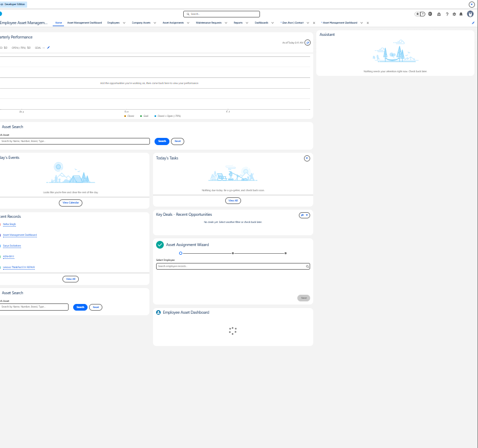
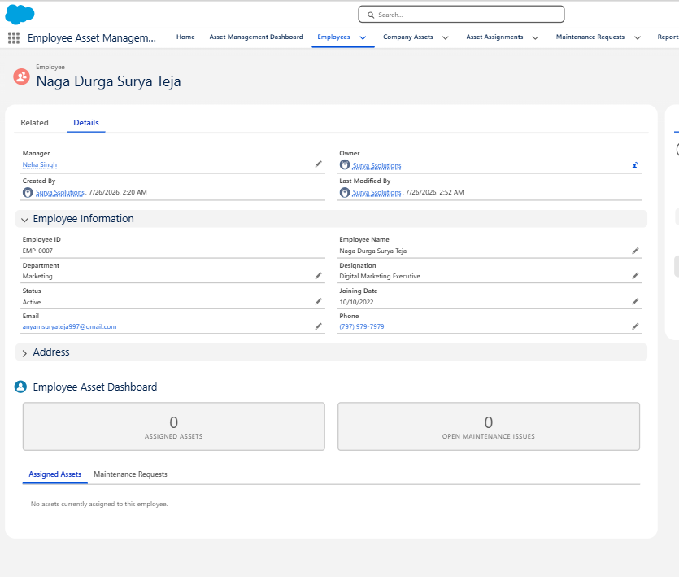
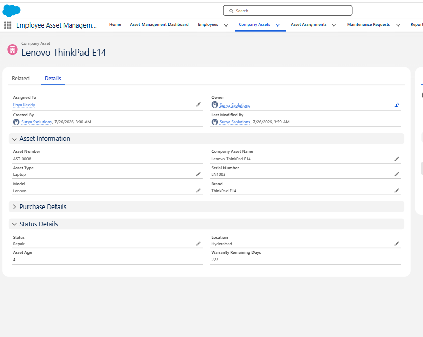
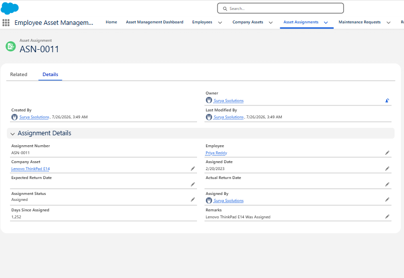
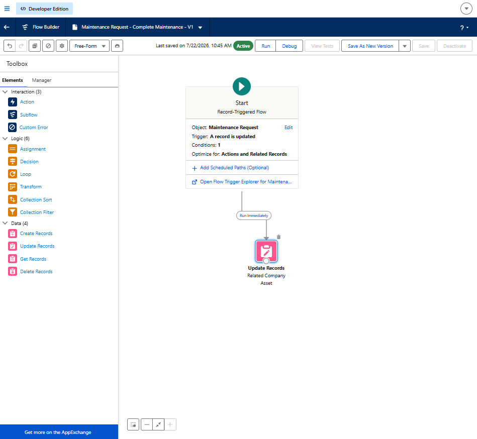
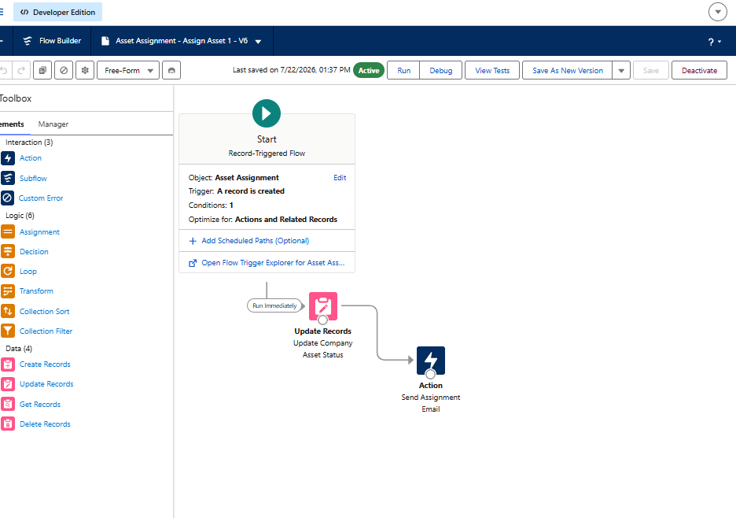
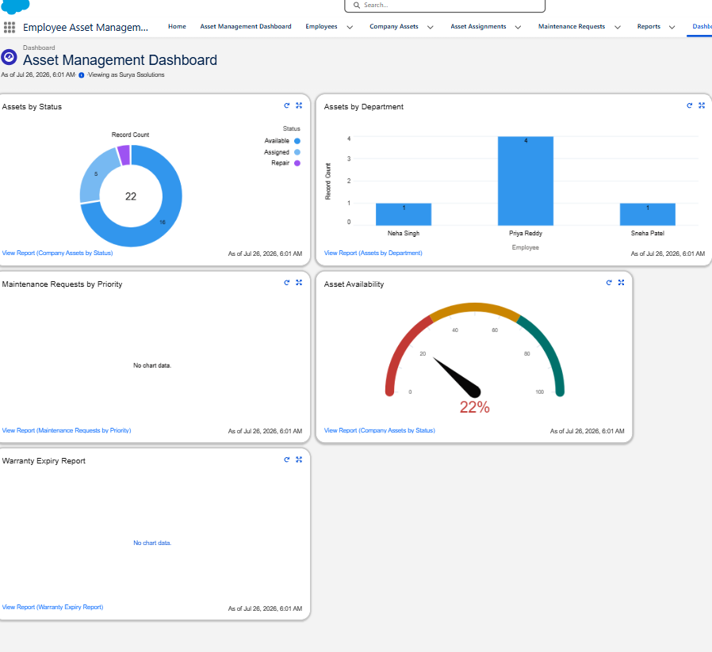
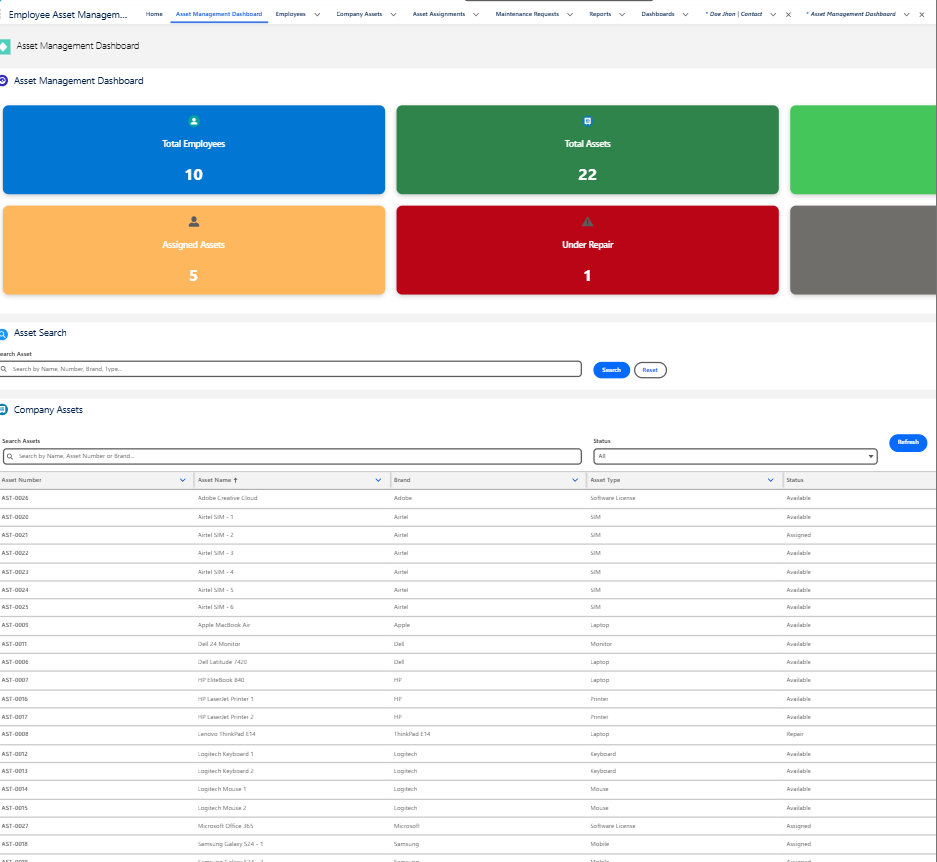

# Employee Asset Management System

A Salesforce-based application designed to manage company assets, employee assignments, asset maintenance, and complete asset lifecycle tracking.

---

# 📌 Project Overview

Employee Asset Management System helps organizations efficiently manage company assets such as:

- Laptops
- Mobile Devices
- Monitors
- Software Licenses
- Other company equipment

The system provides better visibility, automation, and tracking of asset ownership.

---

# 🚀 Features

## 👨‍💼 Employee Management

- Create and manage employee records
- Store employee details
- Track department, designation, and employment status

---

## 💻 Asset Management

Maintain company asset inventory.

Track:

- Asset Name
- Asset Number
- Asset Type
- Brand
- Model
- Purchase Details
- Warranty Information
- Current Status

### Asset Status Tracking

- Available
- Assigned
- Repair
- Lost
- Retired

---

## 🔄 Asset Assignment Management

- Assign assets to employees
- Maintain assignment history
- Track assigned date and return date
- Monitor asset ownership

---

## 🛠 Maintenance Management

- Create maintenance requests
- Track repair status
- Assign technicians
- Maintain asset service history

---

# ⚙️ Salesforce Automation

Implemented automation using:

- Record Triggered Flows
- Apex Logic

Automation Examples:

✅ Automatically update asset status when assigned

✅ Change asset status when returned

✅ Move assets to repair status during maintenance

✅ Update asset availability after repair completion

---

# 💻 Lightning Web Components (LWC)

Custom Lightning Web Components developed:

- Asset Search Component
- Asset Dashboard Cards
- Asset Data Table
- Employee Asset Dashboard
- Asset Assignment Wizard

---

# 🏗️ Salesforce Architecture

## Data Model

Employee
|
|
Asset Assignment
|
|----------------|
| |
Company Asset Maintenance Request

---

## Automation Layer

Salesforce Flow
|
|
|
Asset Assignment
Asset Return
Maintenance Request
|
|
Update Asset Status Automatically

---

## Application Layer

Users
|
|
Lightning Experience
|
| |
LWC Components Reports & Dashboards
|
Apex Controllers
|
Salesforce Objects

---

# 🛠️ Technologies Used

| Technology | Usage |
|---|---|
| Salesforce Platform | Application Development |
| Salesforce DX | Project Structure |
| Apex | Backend Logic |
| SOQL | Data Queries |
| Lightning Web Components | User Interface |
| Salesforce Flows | Automation |
| Git | Version Control |
| GitHub | Source Management |

---

# 📂 Project Structure

EmployeeAssetManagement
│
├── force-app
│ └── main
│ └── default
│ ├── classes
│ ├── lwc
│ ├── objects
│ ├── flows
│ └── permissionsets
│
├── screenshots
│
├── config
│
├── scripts
│
├── package.json
│
└── sfdx-project.json

---

# 📦 Deployment

Clone repository:

git clone https://github.com/Suryateja997/employee-asset-management-system.git

Authorize Salesforce Org:

sf org login web

Deploy source:

sf project deploy start

---

# 👨‍💻 Developer

**Surya Teja**

Salesforce Developer

Skills:

- Salesforce Administration
- Apex Development
- Lightning Web Components
- Salesforce Automation
- SOQL
- Git & GitHub

---

# 📸 Application Screenshots

## 1. Application Home

## 2. Employee Record

## 3. Company Asset

## 4. Asset Assignment

## 5. Maintenance Request

## 6. Asset Status Flow

## 7. Lightning Web Components

## 8. Dashboard

---

⭐ If you find this project useful, feel free to explore and learn.
